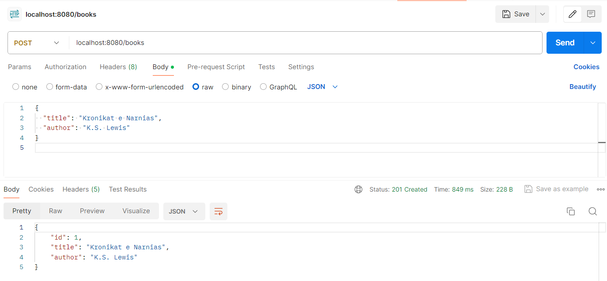
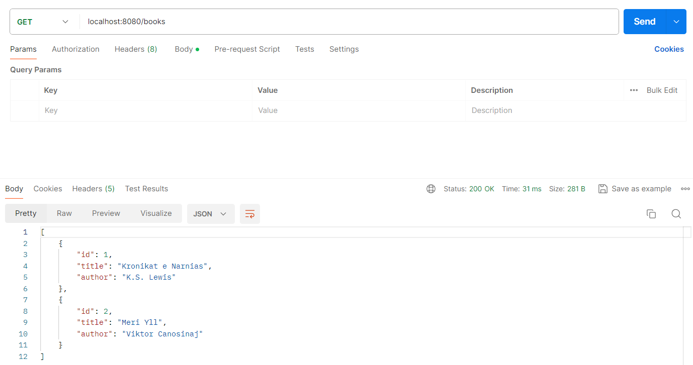
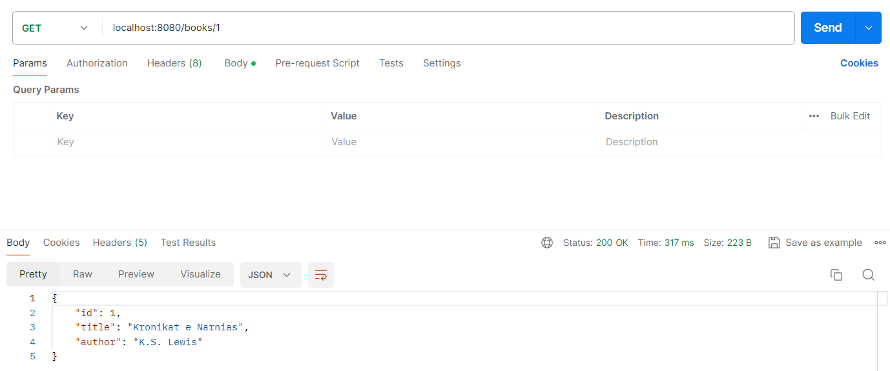

Ky është një aplikacion Spring Boot i thjeshtë që ofron operacionet CRUD (Krijo, Lexo, Përditëso, Fshij) për entitetin "Book".

**_🚀 Funksionaliteti Kryesor_**

Aplikacioni lejon përpunimin e të dhënave për librat në mënyrë të thjeshtë dhe efikase. Përmes këtij aplikacioni, ju mund të:

Krijo: Shtoni libra të rinj në bazën e të dhënave.
Lexo: Lexoni të dhënat e të gjithë librave ose të një libri të caktuar duke përdorur ID-në e tyre.
Përditëso: Modifikoni informacionin e një libri duke përdorur ID-në e tij.
Fshij: Fshijeni librin e dëshiruar nga baza e të dhënave bazuar në ID-në e tij.
Aplikacioni është i ndërtuar përmes teknologjive Spring Boot dhe MySQL.

**_🔄 Rrjedha e Përgjithshme_**

Çdo metodë në kontrollerin e aplikacionit është përgjegjëse për të trajtuar një lloj kërkesë nga klienti. Për shembull, nëse një kërkesë është për të lexuar të gjithë librat, metoda getAllBooks thirret. Ky metodë kthen një listë e të gjithë librave në formë të një objekti ResponseEntity, ku përmbanë të dhënat e librave të lexuar nga një shërbim të dedikuar. Metodat e tjera si getBook, createBook, updateBookById dhe deleteBook kanë funksionime të ngjashme, por ndryshojnë në mënyrën se si ata trajtojnë kërkesat për lexim, krijim, përditësim dhe fshirje të një libri. Për çdo metodë, kthehet një përgjigje e përshtatshme për klientin, për shembull, një libër i kërkuar, një listë e të gjithë librave, ose një përgjigje e thjeshtë konfirmimi.

**_Testimi i CRUD Operacioneve me Postman_**

Për të testuar operacionet CRUD të këtij aplikacioni duke përdorur Postman, ju mund të ndiqni hapat e mëposhtëm:

**Ruani/Krijoni një libër:**

* Metoda: POST
* Endpoint: http://localhost:8080/books
* Body: JSON i një objekti të librit të ri

****Merrni/lexoni të gjithë librat:****

* Metoda: GET
* Endpoint: http://localhost:8080/books

**Merrni/lexoni një libër të caktuar:**

* Metoda: GET
* Endpoint: http://localhost:8080/books/{id}
* {id}: ID e librit të caktuar

**Përditësoni një libër:**

* Metoda: PUT
* Endpoint: http://localhost:8080/books/{id}
* {id}: ID e librit të caktuar
* Body: JSON për të dhënat e librit të përditësuar

