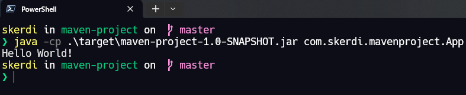

# Generating a simple Maven project

## Steps

1. Download `maven`
2. Create a directory where the project will be stored
   - In out case let it be the  `Java Enterprise MPL`

      ```shell
      mkdir 'Java Enterprise MPL'
      cd 'Java Enterprise MPL'
      ```

3. Create a `mvn` project

    ```shell
    mvn archetype:generate -DgroupId='com.skerdi.mavenproject' -DartifactId='maven-project' -DarchetypeArtifactId='maven-archetype-quickstart' -DarchetypeVersion='1.4' -DinteractiveMode='false'
    ```

4. Build the maven project

   ```shell
   mvn package
   ```

5. Run the project

   ```shell
   java -cp target/maven-project-1.0-SNAPSHOT.jar com.skerdi.mavenproject.App
   ```

   
